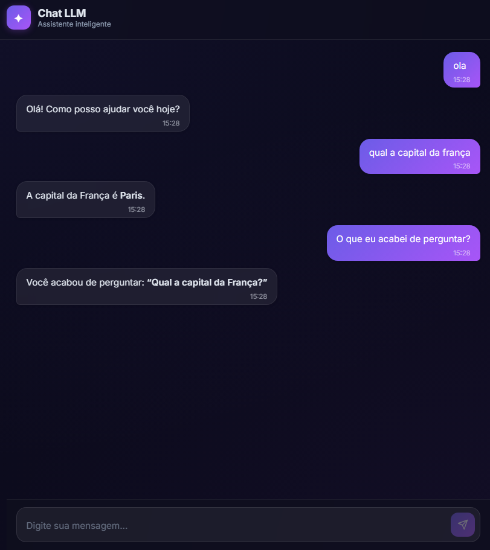
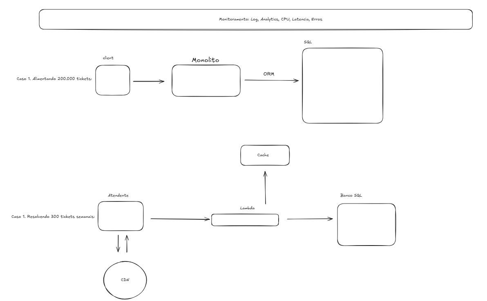

# ✦ Chat LLM

Assistente de chat inteligente com interface web moderna, powered by **Groq** (modelo `gpt-oss-20b`).

O projeto é composto por um **backend em Python (FastAPI)** que se comunica com a API da Groq via SDK OpenAI, e um **frontend em React (Vite)** que oferece uma interface de chat em tempo real.

---

## 📸 Visão Geral

| Camada   | Tecnologia                           |
| -------- | ------------------------------------ |
| Backend  | Python 3, FastAPI, Uvicorn, OpenAI SDK |
| Frontend | React 19, Vite 8, react-markdown    |
| LLM      | Groq API (`gpt-oss-20b`)            |

---

## 🗂️ Estrutura do Projeto

```
.
├── main.py               # API FastAPI (backend)
├── requirements.txt      # Dependências Python
├── .env                  # Variáveis de ambiente (não versionado)
├── frontend/
│   ├── index.html        # Entry point HTML
│   ├── package.json      # Dependências Node
│   ├── vite.config.js    # Configuração do Vite
│   └── src/
│       ├── main.jsx      # Bootstrap do React
│       ├── App.jsx       # Componente principal
│       ├── App.css       # Estilos do App
│       ├── index.css     # Estilos globais
│       ├── components/
│       │   ├── ChatWindow.jsx   # Janela de mensagens
│       │   ├── ChatWindow.css
│       │   ├── InputBar.jsx     # Barra de input
│       │   ├── InputBar.css
│       │   ├── MessageBubble.jsx # Bolha de mensagem
│       │   └── MessageBubble.css
│       └── services/
│           └── api.js    # Client HTTP para o backend
└── README.md
```

---

## ⚙️ Pré-requisitos

- **Python 3.10+**
- **Node.js 18+** e **npm**
- Uma chave de API da [Groq](https://console.groq.com/)

---

## 🚀 Instalação e Execução

### 1. Clone o repositório

```bash
git clone https://github.com/PedroLucasFernandes/chat-llm.git
cd chat-llm
```

### 2. Configure as variáveis de ambiente

Crie um arquivo `.env` na raiz do projeto:

```env
GROQ_API_KEY=sua_chave_groq_aqui
```

### 3. Backend (Python)

```bash
# Crie e ative o ambiente virtual
python -m venv venv
source venv/bin/activate   # Linux/macOS
# venv\Scripts\activate    # Windows

# Instale as dependências
pip install -r requirements.txt

# Inicie o servidor
python main.py
```

O backend estará disponível em `http://localhost:8000`.

### 4. Frontend (React)

```bash
cd frontend

# Instale as dependências
npm install

# Inicie o servidor de desenvolvimento
npm run dev
```

O frontend estará disponível em `http://localhost:5173`.

---

## 🔌 API

### `POST /chat`

Envia uma mensagem e recebe a resposta da LLM.

**Request Body:**

```json
{
  "message": "Olá, como você pode me ajudar?",
  "session_id": null
}
```

| Campo        | Tipo             | Descrição                                      |
| ------------ | ---------------- | ---------------------------------------------- |
| `message`    | `string`         | Mensagem do usuário (obrigatória, não vazia)   |
| `session_id` | `string \| null` | ID da sessão; `null` para iniciar uma nova     |

**Response:**

```json
{
  "response": "Olá! Posso te ajudar com diversas tarefas...",
  "session_id": "a1b2c3d4-e5f6-7890-abcd-ef1234567890"
}
```

| Campo        | Tipo     | Descrição                        |
| ------------ | -------- | -------------------------------- |
| `response`   | `string` | Resposta gerada pela LLM        |
| `session_id` | `string` | ID da sessão (reutilize-o)       |

**Possíveis erros:**

| Status | Descrição                              |
| ------ | -------------------------------------- |
| `408`  | Timeout na requisição para a LLM       |
| `422`  | Mensagem vazia ou payload inválido     |
| `500`  | Erro interno inesperado                |
| `502`  | Falha de conexão ou erro na API da LLM |

---

## 🧠 Como Funciona

1. O usuário digita uma mensagem no frontend.
2. O frontend envia um `POST /chat` para o backend.
3. O backend mantém um **histórico de conversas em memória** por `session_id`.
4. A mensagem, junto com o histórico, é enviada para a **API da Groq** (compatível com OpenAI).
5. A resposta da LLM é adicionada ao histórico e devolvida ao frontend.
6. O componente `MessageBubble` renderiza a resposta com suporte a **Markdown** via `react-markdown`.

> **Nota:** O histórico é armazenado em memória (não persistente). Reiniciar o backend limpa todas as sessões.
> 

---

## 🛠️ Tecnologias

### Backend

- [FastAPI](https://fastapi.tiangolo.com/) — Framework web assíncrono de alta performance
- [Uvicorn](https://www.uvicorn.org/) — Servidor ASGI
- [OpenAI Python SDK](https://github.com/openai/openai-python) — Client compatível com a API da Groq
- [python-dotenv](https://github.com/theskumar/python-dotenv) — Carregamento de variáveis de ambiente
- [Pydantic](https://docs.pydantic.dev/) — Validação de dados

### Frontend

- [React 19](https://react.dev/) — Biblioteca de UI
- [Vite 8](https://vitejs.dev/) — Build tool e dev server
- [react-markdown](https://github.com/remarkjs/react-markdown) — Renderização de Markdown

---

## 📄 Licença

Este projeto é de uso pessoal/educacional.

## System Design

Abaixo está uma foto do desafio de System Design:
> 
